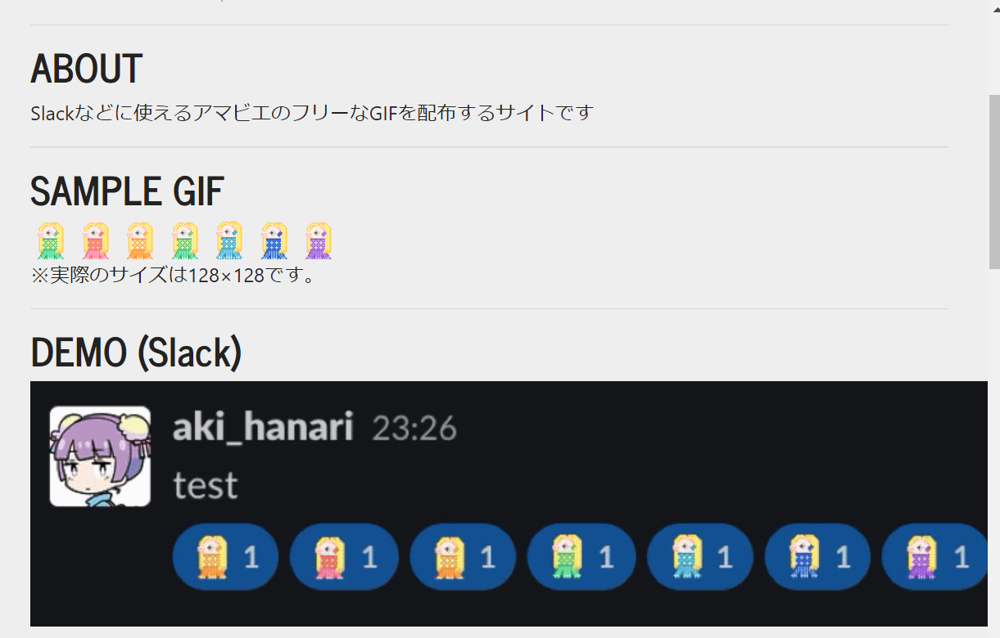
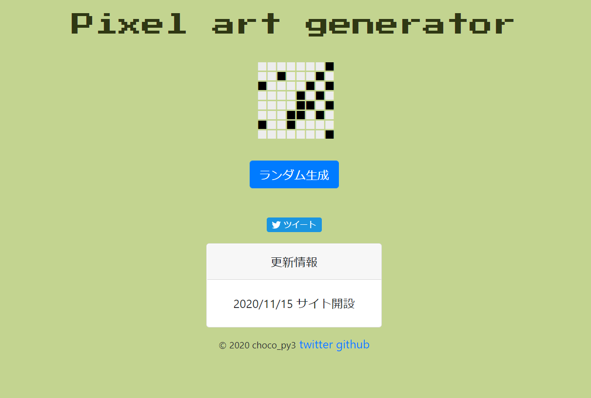

# About
choco_py3's portfolio site

## Profile
- 名前: choco_py3
- 年齢: 27
- 趣味: イラスト、写真

## Career
- ネットワークエンジニアとして、約3年半設計構築業務を担当していました。
- 基本設計/詳細設計/テスト/ネットワーク構築など
- L2/L3SW, FW等(Cisco,富士通）

## Skills
- OS: Windows7/8/10, MacOSX, Ubuntu
- 言語: Python, C, Processing(p5.js), JavaScript, HTML5, CSS
- フレームワーク: Flask, Django, Bootstrap
- ツール: Git, GitHub
- 資格: AWS SAA, CCNP, 情報処理安全確保支援士(合格), ネットワークスペシャリスト, ITサービスマネージャ

## Works
- [GitHub](https://github.com/akihanari)
- [Qiita](https://qiita.com/akihanari)
- [FreeCodeCamp_Project/TributePage](https://codepen.io/akihanari/pen/NWqYOgP)
- [OpenProcessing](https://www.openprocessing.org/user/215370)

- [Space Cat Love!(Website)](https://akihanari.github.io/hackathon_01/)
  - 言語: HTML5, CSS3, Javascript(p5.js)
  - 概要: Space Catとお絵かきをすることができるWebアプリです。
  

- [gif-amabie(Website)](https://akihanari.github.io/gif-amabie/)
  - 言語: HTML5, CSS3
  - フレームワーク: Bootstrap
  - 概要: Slackの絵文字などに使用できるアマビエのGIFファイルを配布しています。

- [choco_py3's contents(Website)](https://flaskandheroku.herokuapp.com/)
  - 言語: Python, HTML5, CSS3
  - フレームワーク: Flask, Bootstrap
  - 概要: Pixel art generator→ドット絵をランダムに生成　p5.js gallery→p5.jsの作品集
  

- [Django-Website](https://ha-workshop.herokuapp.com/)
  - 言語: Python, HTML5, CSS3
  - フレームワーク: Django, Bootstrap
  - DB: PostgreSQL
  - 参考チュートリアル: [Django Girls Tutorial](https://tutorial.djangogirls.org/ja/)

- [Slackbot / for-ni-to](https://github.com/akihanari/Slackbot)
  - 言語: Python
  - 概要: botに話しかけると天気予報やQiita記事検索、雑談などをすることができます。

## OSS Contribute
- [Cult of the Party Parrot](https://cultofthepartyparrot.com/)
  - [GitHub](https://github.com/jmhobbs/cultofthepartyparrot.com)

## Competitive programming
- [AtCoder](https://atcoder.jp/users/akihanari)

## Contact
- [Twitter](https://twitter.com/choco_py3)
- [Mail](akihanari@gmail.com)

<a class="twitter-timeline" data-width="400" data-height="600" data-theme="dark" href="https://twitter.com/choco_py3?ref_src=twsrc%5Etfw">Tweets by choco_py3</a> 

